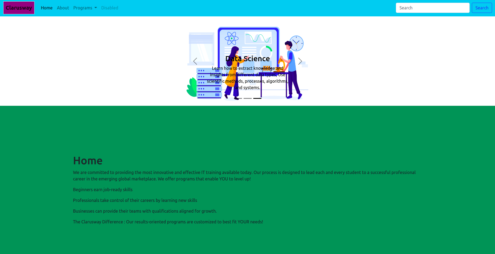

<p>Clarusway</p>

# Project-006 : Bootstrap Home Page (HC-006)

## Description
Project aims to create home page with bootstrap.

## Problem Statement

- Your company is creating its website home page with bootstrap. 

## Project Skeleton 

```
006-bootstrap-home-page(folder)
|
|----readme.md         # Given to the students (Definition of the project)
|----/images # Contains development team members photos         
|----solution
        |----index.html  
```

## Expected Outcome



## Objective

Build a responsive web page similar to [Bootstrap Home Page](https://8490.github.io/bootstrap-basic-home-page/).

You can find images [here.](./images)

### At the end of the project, following topics are to be covered;

- HTML 

- CSS

- BOOTSTRAP 5


### At the end of the project, students will be able to;

- improve coding skills within HTML & CSS & BOOTSTRAP

- use git commands (push, pull, commit, add etc.) and Github as Version Control System.

## Steps to Solution
  
- Step 1: Download or clone project repo on Github 

- Step 2: Create project folder for local public repo on your pc

- Step 3: Bootstrap Home Page

- Step 4: Push your application into your own public repo on Github

- Step 5: Deploy your application on Github template to showcase your app within your team.

## Notes

- Your page should be responsive web.

<center> ⌛ Happy Coding  ✍ </center>

